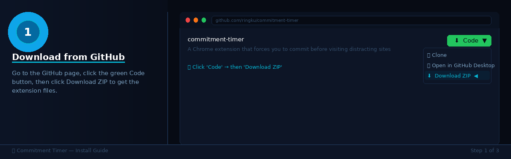
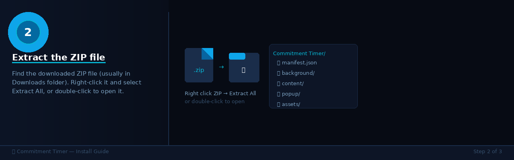
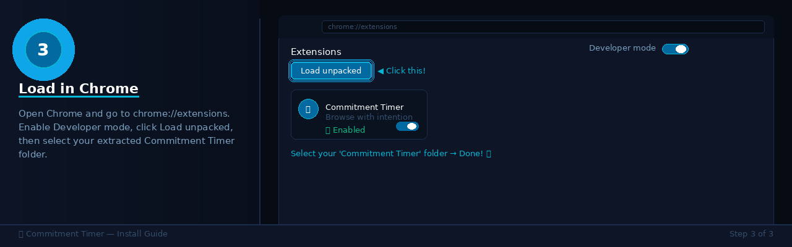

# 🔒 Commitment Timer

> Browse with intention, not impulse.

A Chrome extension that forces you to commit to a reason before visiting
distracting sites like YouTube, Reddit, or Twitter — then holds you accountable.

## ✨ Features

- 🔒 Intercepts distracting sites with a commitment screen
- ⏱️ Floating countdown timer while you browse
- 😬 Guilt screen when time's up — did you keep your promise?
- 🔥 Streak tracking — consecutive days of kept promises
- ⏸️ Snooze tax — extensions get progressively harder
- ❄️ Cooldown penalty — break a promise, site locked 10 mins
- 📊 Dashboard with honesty score + 30-day calendar
- 🔘 Enable/disable toggle anytime

---

## 🚀 Install Guide (2 minutes)

### Step 1 — Download

Click the green **Code** button above → **Download ZIP** → save to your computer

---

### Step 2 — Extract

Find the ZIP in your Downloads folder → right-click → **Extract All**

---

### Step 3 — Load in Chrome

1. Open Chrome → go to `chrome://extensions`
2. Enable **Developer mode** (top right toggle)
3. Click **Load unpacked**
4. Select the extracted `Commitment Timer` folder
5. ✅ Done!

---

## 🌐 Blocked Sites (default)

YouTube · Reddit · Twitter · Instagram · TikTok · Facebook · X

You can add/remove sites via the extension settings ⚙️

## 🛡️ Privacy

Everything stays on your device. No data is collected or transmitted ever.
[Privacy Policy](https://ringku1.github.io/commitment-timer/privacy-policy.html)

## 📄 License

MIT
